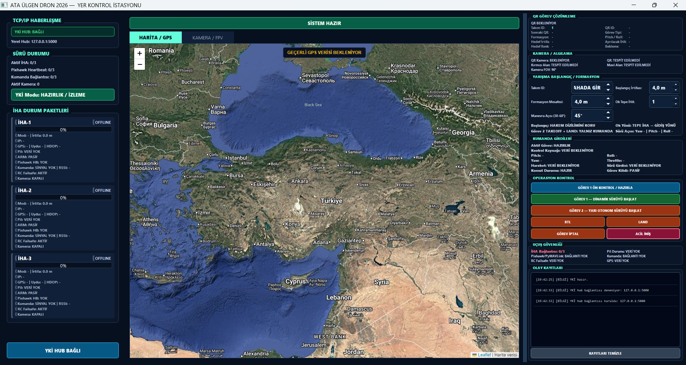
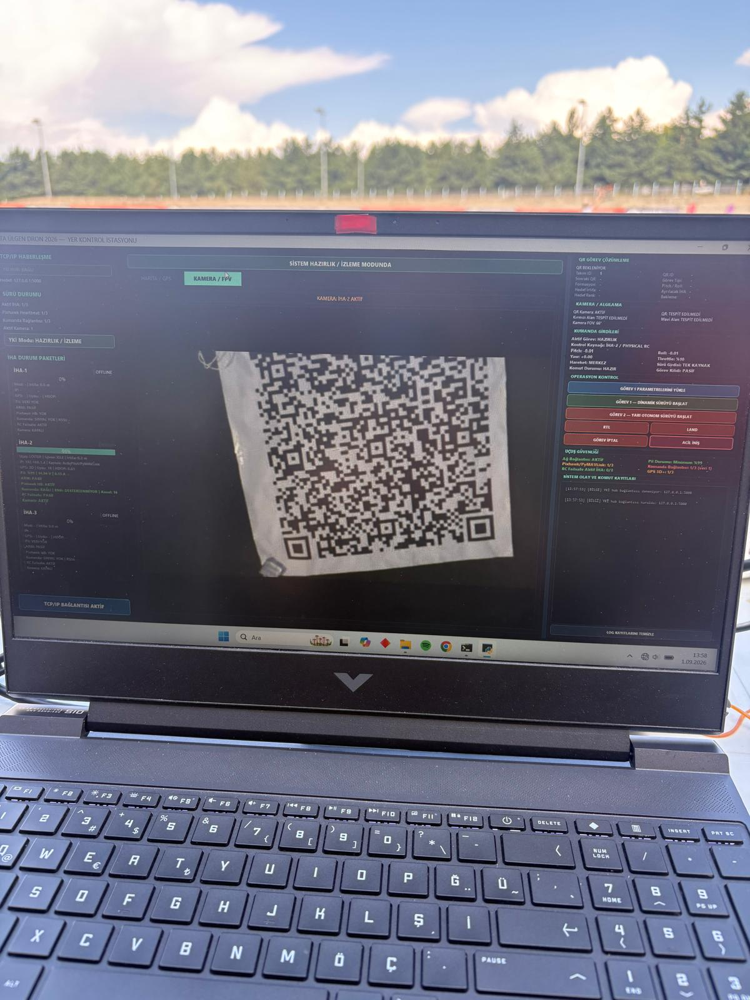

# TEKNOFEST Sürü İHA Projesi

### Çoklu İHA Koordinasyonu, Yer Kontrol İstasyonu ve Görev Yönetimi

## Proje Hakkında

Bu çalışma, TEKNOFEST Sürü İHA Yarışması kapsamında takım olarak geliştirdiğimiz çoklu insansız hava aracı sistemini ve projedeki bireysel katkılarımı tanıtmaktadır. Takımımız yarışmada finalist olarak yer almıştır.

Proje kapsamında üç İHA’nın ortak görev akışı içerisinde koordineli biçimde çalışması üzerine yazılım ve donanım entegrasyonu çalışmaları yürütülmüştür. Formasyon kontrolü, görev yönetimi, görüntü işleme ve ağ üzerinden haberleşme bileşenleri, yer kontrol istasyonu ile birlikte ele alınmıştır.

## Projenin Amacı ve Kapsamı

Çalışmanın temel amacı, birden fazla İHA’nın belirlenen görevler doğrultusunda birlikte hareket etmesini sağlayacak sistemin geliştirilmesi ve saha koşullarında değerlendirilmesidir.

Bu kapsamda farklı formasyonların oluşturulması, araçların durum bilgilerinin izlenmesi, görev komutlarının iletilmesi ve görüntü işleme çıktılarının görev akışıyla ilişkilendirilmesi üzerine çalışılmıştır. Geliştirme sürecinde yazılım modüllerinin tek başına çalışmasının yanı sıra, bütün sistem içerisindeki veri ve komut alışverişi de değerlendirilmiştir.

## Sistem Yapısı

| Bileşen                   | Projedeki Rolü                                                                    |
| ------------------------- | --------------------------------------------------------------------------------- |
| Yer kontrol istasyonu     | Araç durumlarının izlenmesi, görev yönetimi ve operatör arayüzü                   |
| İHA üzerindeki bilgisayar | Araç üzerindeki görev yazılımının ve görüntü işleme bileşenlerinin çalıştırılması |
| Uçuş kontrolcüsü          | Uçuş kontrolü ve araç durum bilgilerinin sağlanması                               |
| Haberleşme altyapısı      | Yer kontrol istasyonu ile İHA’lar arasında veri ve komut aktarımı                 |
| Görüntü işleme            | Kamera görüntülerinden QR kod ve renk bilgisi elde edilmesine yönelik çalışmalar  |

Araç üzerindeki bilgisayar ile Pixhawk uçuş kontrolcüsü arasındaki iletişimde MAVLink protokolü ve pymavlink kullanılmıştır. Yer kontrol istasyonu ile araçlar arasındaki haberleşme, router üzerinden kurulan yerel ağda TCP bağlantılarıyla yürütülmüştür.

## Temel Çalışma Alanları

### Formasyon ve Çoklu Araç Koordinasyonu

Ok başı, çizgi ve V formasyonlarına yönelik çalışmalar yürütülmüştür. Araçların formasyon içerisindeki konumlarının ve hareketlerinin birlikte değerlendirilmesi, projenin temel çalışma alanlarından biridir.

### Yer Kontrol İstasyonu ve Görev Yönetimi

Yer kontrol istasyonu, operatörün araçları takip etmesini ve görev akışını yönetmesini sağlayan arayüz olarak ele alınmıştır. Araçlardan gelen bilgilerin görüntülenmesi, görev komutlarının ilgili yazılım bileşenlerine iletilmesi ve bağlantı durumlarının takip edilmesi üzerine çalışılmıştır.

### Görüntü İşleme

Takımın görüntü işleme çalışmalarında kamera görüntülerinden QR kodların okunması ve görev kapsamında kullanılan renkli hedeflerin algılanması üzerine çalışılmıştır. Kamera çıktıları, görüntü formatı ve saha koşullarındaki görüntü kalitesi entegrasyon sürecinde değerlendirilmiştir.

### Yazılım ve Donanım Entegrasyonu

Raspberry Pi, kamera, uçuş kontrolcüsü ve yer kontrol istasyonunun birlikte çalışması için modüller arasındaki bağlantılar ve veri akışları incelenmiştir. Geliştirme ve test süreçlerinde bağlantı sorunları, yazılım bağımlılıkları ve çalışma ortamı yapılandırmaları üzerinde düzenlemeler yapılmıştır.

## Projedeki Bireysel Katkılarım

Proje bir takım çalışmasıdır. Aşağıdaki maddeler, yazılım ekibi içerisindeki kişisel sorumluluklarımı ve katkılarımı açıklamaktadır.

- **Yer kontrol istasyonu:** Arayüz geliştirme, görevlerin izlenmesi ve yönetilmesi ile yarışma sırasında yer kontrol istasyonunun kullanımında sorumluluk aldım.
- **Genel kod kontrolü:** Takım arkadaşlarımla birlikte kodun incelenmesine, modüller arasındaki uyumun kontrol edilmesine ve yazılım sorunlarının giderilmesine katkı sundum.
- **Sistem entegrasyonu:** Yer kontrol istasyonu, araç üzerindeki görev yazılımı ve haberleşme bileşenlerinin birlikte çalışmasına yönelik süreçlere katıldım.
- **Test ve hata giderme:** Saha denemelerinde gözlenen sorunların değerlendirilmesi, kaynaklarının araştırılması ve gerekli yazılım düzenlemelerinin yapılması çalışmalarında görev aldım.

Görüntü işleme, pilotaj ve donanım çalışmaları takım içerisindeki görev paylaşımı doğrultusunda yürütülmüştür.

## Kullanılan Teknolojiler

| Alan                            | Teknolojiler                       |
| ------------------------------- | ---------------------------------- |
| Programlama                     | Python                             |
| Uçuş kontrolcüsü ile haberleşme | MAVLink, pymavlink                 |
| Görüntü işleme ve kamera        | OpenCV, Picamera2                  |
| Araç üzerindeki bilgisayar      | Raspberry Pi                       |
| Uçuş kontrolcüsü                | Pixhawk                            |
| Kamera                          | Raspberry Pi Camera Module 3       |
| Ağ iletişimi                    | Yerel ağ, router, TCP              |
| Çalışma ortamı                  | Linux, SSH, Python sanal ortamları |

## Test Süreci ve Kazanımlar

Geliştirme sürecinde bağlantı kontrolleri, yazılım modüllerinin birlikte çalışması, kamera görüntülerinin alınması ve görev akışlarının değerlendirilmesine yönelik denemeler gerçekleştirilmiştir. Saha testlerinde karşılaşılan sorunlar doğrultusunda yazılım ve sistem yapılandırmaları gözden geçirilmiştir.

Bu çalışma; çoklu araç sistemlerinde haberleşme, görev yönetimi, kullanıcı arayüzü ve donanım entegrasyonunun birlikte ele alınması konusunda uygulamalı deneyim sağlamıştır. Takım içerisinde görev paylaşımı, teknik sorunların birlikte çözülmesi ve saha geri bildirimlerinin geliştirme sürecine aktarılması da projenin önemli kazanımları arasındadır.

## Depo Kapsamı

Bu depo, projenin teknik yaklaşımını ve bireysel katkılarımı açıklayan bir portfolyo sunumudur. Yarışmada kullanılan sistemin eksiksiz kaynak kod paketini veya doğrudan çalıştırılabilir bir uçuş yazılımını içermez.

## Proje Görselleri

### Yer Kontrol İstasyonu Arayüzü

İHA bağlantıları olmadan hazırlık ve izleme ekranı. Harita, araç durum panelleri, görev kontrolleri ve olay kayıtları görüntülenmektedir.

### Saha Çalışması — Kamera Görüntüsü

Saha çalışması sırasında yer kontrol istasyonunda kamera görüntüsünün izlenmesi.

